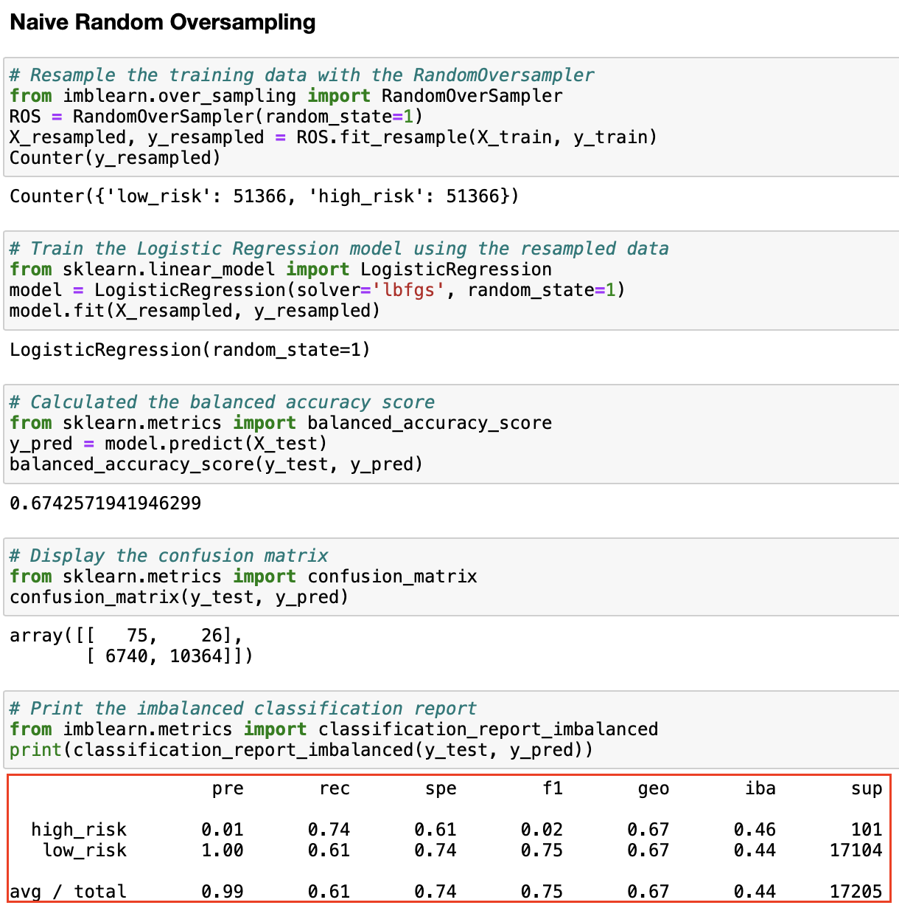
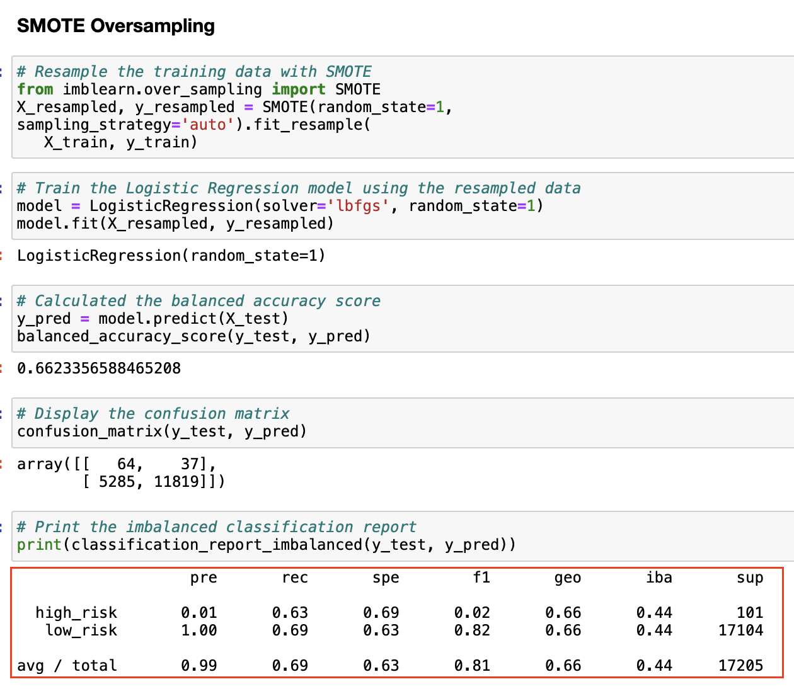
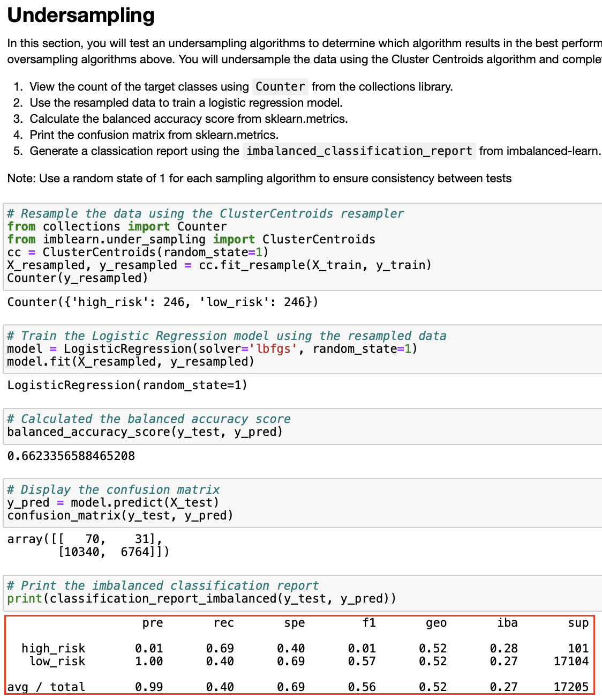
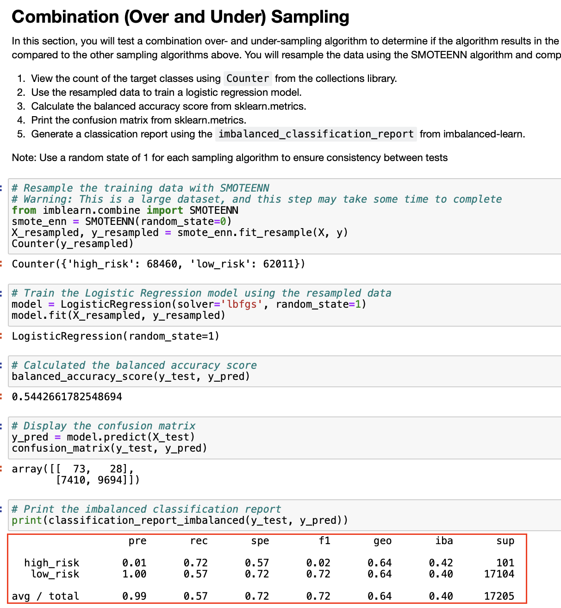
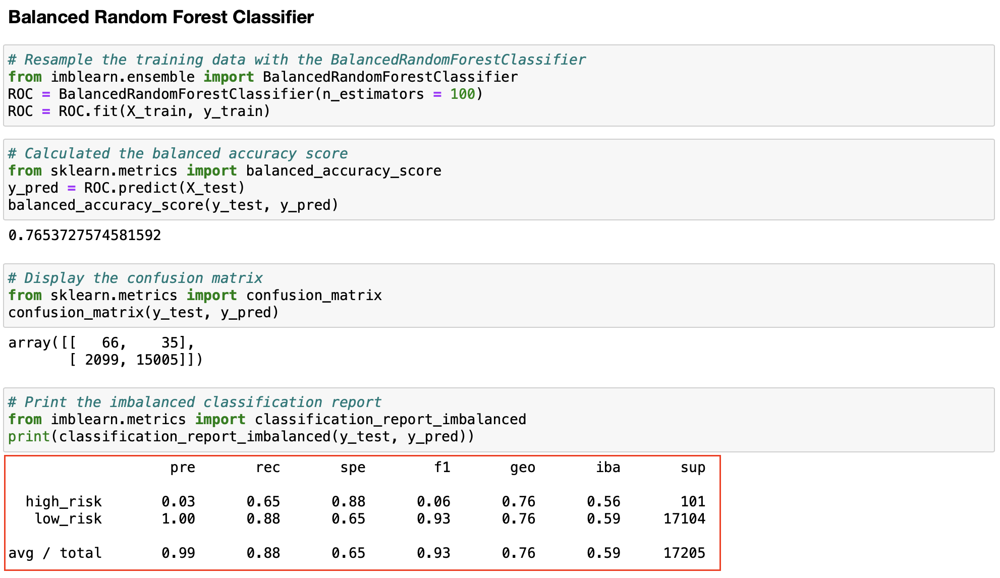
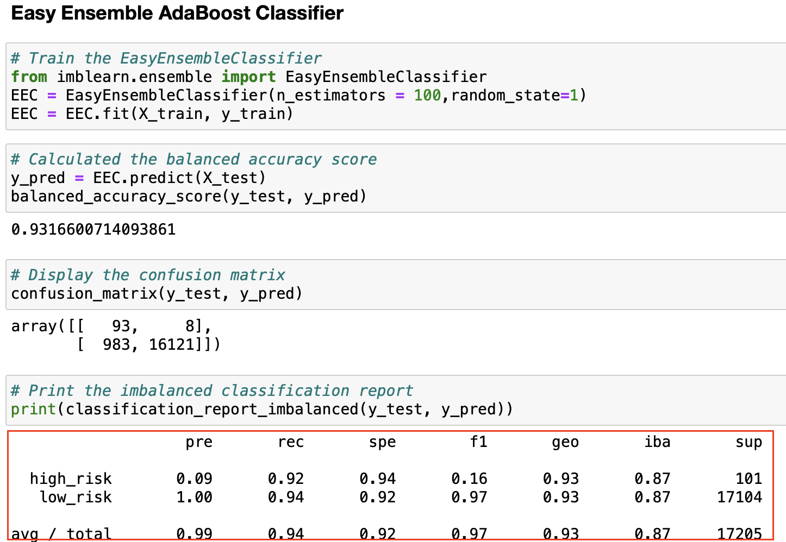

# Credit Risk Analysis

## Overview

The objective of this analysis is to apply six different unbalanced machine learning models to the same dataset and compare the results obtained. The dataset used contains the credit applications for the first quarter of 2019, obtained from a personal credit company called LendingClub. The original data file contains information on 115675 applications.

We will use the RandomOverSampler and SMOTE algorithms to oversample the credit card credit dataset from LendingClub, a peer-to-peer lending services company, and the ClusterCentroids algorithm to undersample the data. The SMOTEENN algorithm will then be used to perform a combinatorial approach of over- and undersampling. Then, to predict credit risk, we will compare two machine learning models that reduce bias, BalancedRandomForestClassifier and EasyEnsembleClassifier. After that, we will assess the performance of these models and conclude whether they should be used to predict credit risk.
 

## Results
	

### Naive Random Oversampling	

  - Balanced accuracy test score: 67% accuracy of model
  - high_risk score: 0.01
  - recall score: 61% sensitivity 

### SMOTE	

  - Balanced accuracy test score: 66% accuracy of model
  - high_risk score: 0.01
  - recall score: 69% sensitivity 

### Undersampling

  - Balanced accuracy test score: 66% accuracy of model
  - high_risk score: 0.01
  - recall score: 40% sensitivity 

### Combination

  - Balanced accuracy test score: 54% accuracy of model
  - high_risk score: 0.01
  - recall score: 57% sensitivity 

### Balanced Random Forest Classifier

  - Balanced accuracy test score: 76% accuracy of model
  - high_risk score: 0.03
  - recall score: 88% sensitivity 

### Easy Ensemble AdaBoost Classifier

  - Balanced accuracy test score: 93% accuracy of model
  - high_risk score: 0.09
  - recall score: 94% sensitivity 

## Summary 

- Out of the six machine learning models used on the loan data for credit risk, the first four models are not as effective as the accuracy score is not as high in comparison to the ensemble classifiers. The most accurate model was "Easy Ensemble AdaBoost Classifier" as it is the most effective since it has the highest score for high_risk loans. 

